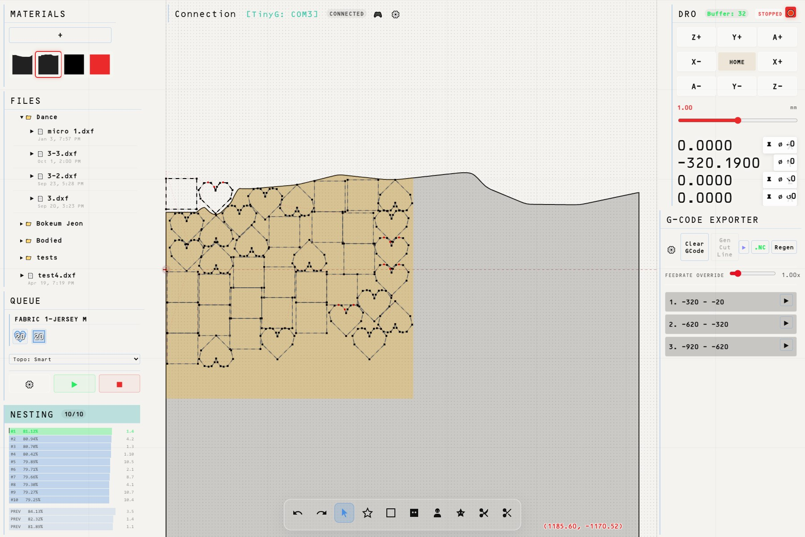

# Knife Controller & CAM Architecture:

This is essentially a customized minimal chilipeppr, a dxf parser built around CLO3d specific layer formats (legacy version: https://github.com/rbuttress/clo2dxf) with a few key drawing functions from inkscape borrowing from PathtoGcode from inkscape gcode tools, a crude replica of deepnest.io, and a 4 axis gcode post processor (legacy version: https://github.com/rbuttress/xyz2xyza) for the tangential knife table I built in 2023 https://github.com/rbuttress/full

Here I gathered a workflow spanning 5 tools into one local javascript application that does the following:

## Feature List

## Backend Server & API (`/`, `server.js`)

- **Dynamic DXF Discovery**
  Scans local directories and sorts available CAD files by modification date to build a nested hierarchy.
- **Fabric Database API**
  Implements full CRUD (Create, Read, Update, Delete) REST operations for managing material inventory via a flat JSON file.

## Core Engines & Mathematics (`js/core/`)

- **Tangential Knife Compensation (`slicer.js`)**
  Automatically applies calculated corner overcuts and inside undercuts based on blade geometry and lift angle thresholds.
- **Nearest-Neighbor Path Optimizer (`slicer.js`)**
  Re-orders cutting lines and intelligently reverses cut direction (swapping p1/p2) to dramatically minimize rapid gantry movements.
- **Vector Deduplication (`slicer.js`)**
  Analyzes geometry to merge overlapping segments, ensuring the knife never cuts the same shared edge twice.
- **Evolutionary Nesting Worker (`worker.js`, `nester.js`)**
  A Web Worker that breeds high-yield layouts using Genetic Algorithms, Order 1 Crossover, and sequence mutations.
- **Geometric Drop Heuristics (`worker.js`)**
  Packs shapes using advanced placement algorithms including gravity drops, true-shape NFP, and topographic valley sweeps.
- **SPJS Hardware Bridge (`spjs.js`)**
  Maintains a resilient WebSocket connection to a Serial Port JSON Server for bi-directional TinyG communication.
- **Kinematic Machine State (`machine.js`)**
  Tracks global absolute coordinates (X, Y, Z, A), buffer status, and machine operation modes in real-time.
- **Gamepad Vector Drive (`controller.js`)**
  Translates raw analog joystick inputs into continuous, real-time tangent vector moves to manually drive the machine head.
- **Physical Digitizer (`tracer.js`)**
  Logs physical gantry coordinates via gamepad button presses to generate digital edge profiles of oddly shaped scrap remnants.

## Rendering & Canvas Visualizer (`js/visualizer/`)

- **State Orchestrator (`canvas.js`)**
  Centralizes active layout, tool selection, and job simulation states into a single decoupled hub.
- **Hardware-Synced Cut Tracking (`canvas.js`)**
  Passively tracks the physical gantry position and permanently marks digital lines as "cut" when the machine passes over them.
- **Morphological Cut-Line Generator (`canvas.js`)**
  Calculates a smooth "guillotine" cut line below completed operations to efficiently sever used fabric from the roll.
- **High-Performance Render Loop (`renderer.js`)**
  Utilizes `requestAnimationFrame` to continuously draw grids, fabrics, active tool paths, ghost layouts, and G-code simulations.
- **Rapid Jog Aiming (`input.js`)**
  Holding Alt draws a dashed heading line to the cursor and rotates the A-axis; clicking triggers a rapid G0 move to that coordinate.
- **Persistent History Manager (`history.js`)**
  Maintains a state snapshot stack for seamless Ctrl+Z / Ctrl+Y undo/redo functionality and local storage persistence.
- **Selection State Manager (`selection.js`)**
  Handles click-toggling, bounding-box multi-selection, and isolation of custom nesting mask geometry.

## Interactive Canvas Toolkit (`js/visualizer/tools.js`)

- **Select & Drag Tool (`SelectTool`, `FabricDragTool`)**
  Allows dragging individual patterns, shifting the virtual fabric bed to match reality, and right-clicking parts to toggle their nestability.
- **Smart Polyline Tool (`DrawPolyTool`)**
  Draws custom cuts that automatically snap into closed polygons if the cursor approaches the origin point.
- **Nesting Masks (`FreeMaskTool`, `BoxMaskTool`, `PolyMaskTool`)**
  Utilizes ClipperLib boolean intersection math to define explicit zones where the auto-nester is permitted to place parts.
- **Destructive Fabric Chopping (`CutFabricTool`, `PolyCutTool`)**
  Uses boolean difference operations to permanently slice off sections of the virtual fabric outline, simulating physical scrap removal.

## User Interface & Floating Widgets (`js/ui/`)

- **Desktop-Style Window Manager (`window.js`)**
  Creates floating, draggable, dockable widget windows with edge-snapping and dynamic flex-height expansion.
- **G-Code Job Tree (`gcode.js`)**
  Slices massive layouts into horizontal bands (sub-jobs) to accommodate machines that require manual fabric unrolling.
- **Smart Execution & Playback (`gcode.js`)**
  Allows pausing, aborting, or seamlessly resuming a sub-job from any specific clicked line of G-code.
- **Live Line Highlighting (`gcode.js`)**
  Reads line numbers from TinyG serial reports to smoothly auto-scroll and highlight the exact line of code currently executing.
- **DXF Ingestion & Arc Tessellation (`browser.js`)**
  Parses CAD files and interpolates perfect mathematical curves into CNC-ready tiny line segments based on configurable limits.
- **Material Inventory UI (`fabrics.js`)**
  Manages raw roll data and displays scaled digital thumbnails of the physical fabric profiles.
- **Evolutionary Leaderboard (`ranking.js`)**
  Displays the live leaderboard of nesting algorithms as they process, allowing users to hover for a visual yield preview.
- **Safety Digital Read-Out (`dro.js`)**
  Provides jog controls, homing limits, and an input safety lock that forces Z-axis entries to be negative to prevent collisions.
- **Dynamic Coordinate Cursor (`cursor.js`)**
  A floating HUD element that reveals live canvas coordinates or rich metadata depending on hover priority.
